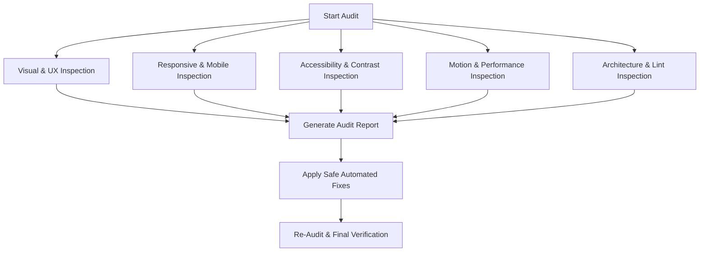

# UI & Frontend Quality Audit Workflow

When invoked, this audit workflow executes an exhaustive, multi-dimensional inspection of the application, produces a categorized quality scorecard, applies automated fixes for detected issues, and re-audits the codebase.

---

## 1. Multi-Dimensional Audit Matrix

### Audit Vectors & Checkpoints:

1. **Visual Quality & Brand Identity**:
   - Check for visual hierarchy, consistent 4px/8px spatial rhythm, and avoidance of AI cliches (e.g. illegible glassmorphism, muddy gradients).
   - Check for consistent border radii, micro-borders, and shadows.
2. **UX & State Architecture**:
   - Check all 6 component states: Idle, Hover, Focus-Visible, Active/Pressed, Loading, and Empty/Error.
   - Verify non-blocking UI and clear call-to-action paths.
3. **Responsive & Viewport Integrity**:
   - Inspect 320px, 375px, 768px, 1024px, 1440px, and 2560px viewports.
   - Search for horizontal scroll leaks (`overflow-x` bugs, fixed pixel widths).
   - Verify touch targets meet 44x44px minimum sizing.
4. **Accessibility (WCAG 2.1 AA)**:
   - Verify heading hierarchy (`h1` -> `h2` -> `h3`).
   - Audit keyboard tab navigation, modal focus trapping, and focus ring visibility.
   - Check text and icon color contrast ratios (≥4.5:1 for body, ≥3:1 for large text).
   - Verify `aria-label` / `.sr-only` text on icon buttons.
5. **Animation & Interaction Quality**:
   - Ensure animation durations stay within the 150ms–350ms budget.
   - Verify `prefers-reduced-motion` compliance across all Motion/GSAP components.
   - Ensure zero layout property animations (only `transform` and `opacity`).
6. **Performance & Core Web Vitals**:
   - Verify heavy components (3D Canvas, Charts) are dynamically imported with `React.lazy`.
   - Inspect bundle chunk sizes and redundant dependency imports.
   - Ensure 3D Canvas devices pixel ratio is clamped (`dpr={[1, 1.75]}`).
7. **Code & Component Architecture**:
   - Check for monolithic files (>300 lines) needing refactoring.
   - Run type checker (`tsc -b`) and linter (`oxlint` / `eslint`).
   - Check for unhandled exceptions, unused variables, and console errors.

---

## 2. Automated Remediation Protocol

1. **Identify Safe Fixes**:
   - Automatically correct TypeScript and lint compiler errors.
   - Add missing `useReducedMotion()` guards to animated components.
   - Add missing `aria-label` and `alt` attributes.
   - Fix horizontal overflow (`max-w-full`, `overflow-x-auto`).
   - Replace direct heavy imports with `React.lazy` where appropriate.
2. **Execute Remediation**:
   - Apply clean, precise code modifications.
3. **Re-Audit Cycle**:
   - Execute `npm run lint` and `npm run build`.
   - Verify that 0 errors remain.
   - Present a Before-and-After scorecard to the user.
